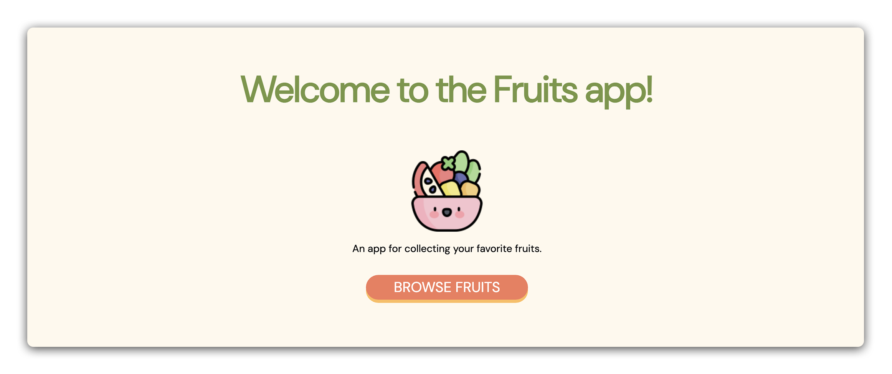

# 

## About

Welcome to the "Fruits" App, a comprehensive module for intermediate learners ready to build a full-stack CRUD application. This module covers essential full-stack development skills, focusing on creating, reading, updating, and deleting data in a web application using Node.js, Express, and EJS. It's the perfect next step for those with foundational web development knowledge, who are ready to work with a database for the first time.

## Prerequisites

- Intro to Express
- RESTful Routing
- EJS
- Intro to Mongoose

## Content

| Lesson                                                                              | Skills                                                          |
| ----------------------------------------------------------------------------------- | --------------------------------------------------------------- |
| [Setup](./lessons/setup.md)                                                         | Setting up the development environment and MVC folder structure |
| [Build and Run `server.js`](./lessons/build-and-run-serverjs.md)                    | Create a basic Express server                                   |
| [Connect to MongoDB with Mongoose](./lessons/use-mongoose-to-connect-to-mongodb.md) | Configure Mongoose connection to MongoDB Atlas                  |
| [Build a Landing Page](./lessons/building-a-landing-page.md)                        | Configure Mongoose connection to MongoDB Atlas                  |
| [Build the Fruit Model](./lessons/build-the-fruit-model.md)                         | Define and export a Mongoose model                              |
| [Build the Fruits Index Page](./lessons/build-the-fruits-index-page.md)             | Find and render all fruits on an `index` page                   |
| [Build the New Fruit Page](./lessons/build-the-new-fruit-page.md)                   | Construct a `new` route and form view                           |
| [Create a Fruit](./lessons/create-a-fruit.md)                                       | Build `create` functionality in a `POST` route                  |
| [Build the Fruits Show Page](./lessons//build-the-fruits-show-page.md)              | Construct a `show` route and view                               |
| [Build the Edit Fruit Page](./lessons/build-the-edit-fruit-page.md)                 | Construct an `edit` route and form view                         |
| [Update a Fruit](./lessons/update-a-fruit.md)                                       | Build `update` functionality in a `PUT` route                   |
| [Delete a Fruit](./lessons/delete-a-fruit.md)                                       | Build `delete` functionality in a `DELETE` route                |
| [Recap](./lessons/recap.md)                                                         | Review technologies used and application architecture           |
|                                                                                     |

## Level Up content

| Lesson                                           | Skills                          |
| ------------------------------------------------ | ------------------------------- |
| [Style the Application](./style-the-application) | Bring your app to life with CSS |
