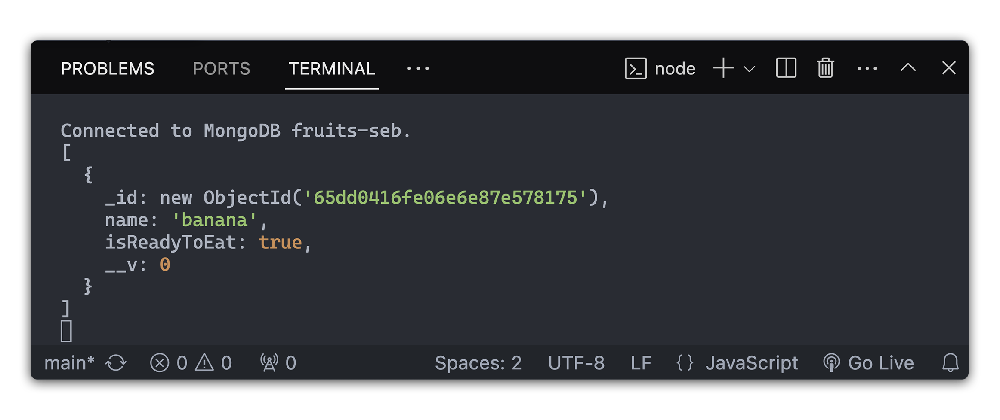

# 

In this lesson, you will be able to build an express route that will find and render all of the fruits in the database.

## A Quick Refresher on MVC

Before we dive in, let’s recall how the **Model–View–Controller (MVC)** pattern keeps our app organized:

| Part           | Responsibility                       | Example                                         |
| -------------- | ------------------------------------ | ----------------------------------------------- |
| **Model**      | Defines the data and how it’s stored | The Fruit schema                                |
| **View**       | Handles what the user sees           | The EJS templates                               |
| **Controller** | Contains the logic for each route    | The functions that render pages or handle forms |

With MVC, each part has its own folder:  
`models/`, `views/`, and `controllers/`.

Our routes will call controller functions instead of writing all logic directly in `server.js`.

## Create the MVC Folders

Let’s make sure our project has dedicated folders for **controllers** and **routes**.

```bash
mkdir controllers routes
```

## Create the Fruits Controller

Inside `controllers` folder, create a file for fruit controllers:

```bash
touch controllers/fruitsController.js
```

## Create the `fruit_index_get` controller

### Import the model into `fruitsController.js`

Let's integrate the `Fruit` model into our `fruitsController.js`. This is important because the controllers we define in `fruitsController.js` will need to use this model to interact with our MongoDB database. To do this, we'll add a require statement for our model in `fruitsController.js`. It's crucial to ensure that this require happens.

Here's how we can include the `Fruit` model in `fruitsController.js`:

```javascript
// fruitsController.js

// Import the Fruit model
const Fruit = require('./models/Fruit.js')
```

With this addition, we're ready to use our `Fruit` model in the request handling functions defined in our express routes. This setup will allow us to perform database operations like creating, reading, updating, and deleting fruit documents in MongoDB.

Add the controller function that handles the logic for showing the "Fruit Index” page:

```js
// Import the Fruit model
const Fruit = require('./models/Fruit.js')

exports.fruit_index_get = async (req, res) => {
  // Retrieve all 'fruit' data
  const allFruits = await Fruit.find()
}
```

<details><summary>💡 Note on "exports"</summary>You’ll often see module.exports used instead of exports.
Both work for sharing code between files, `exports` is simply a shortcut that points to module.exports.

If you assign properties (like exports.fruit_create_get = ...), both are fine.

But if you ever need to export a single function, class, or object, you must use module.exports = ... instead — because assigning directly to exports would break its link to module.exports.</details>

First, we need to retrieve data from the database. In this case, we are looking for all of the fruits. To accomplish this, we'll use Mongoose's `.find()` method. When called without any arguments, `.find()` retrieves all documents within a collection, returning them as an array. Because this operation is asynchronous, we use the `await` keyword to pause the code until the query finishes and store the resulting array in the allFruits variable.



Now that we've successfully retrieved the fruit data from our database, our next objective is to display this data to the user.

In our context, dynamic HTML refers to HTML content generated based on data. It's not static but changes according to the data we pass to it. We will use EJS templates to create such dynamic HTML pages. These templates will be populated with data from our database each time we render them.

We will use `.render()` to respond with a dynamically generated HTML view. The `.render()` method takes two arguments:

```js
exports.fruit_index_get = async (req, res) => {
  const allFruits = await Fruit.find()
  res.render('fruits/index.ejs', { fruits: allFruits }) // new line
}
```

- The first argument is a `string` specifying the path to the EJS template we wish to render. In our case, it's 'fruits/index.ejs'.

- The second argument is an `object` containing the data we want to pass to the template. This data is provided as key/value pairs, where the key is the name we'll use to reference the data in our EJS template.

We'll pass the `allFruits` data to our template under the key `fruits`. This way, our EJS template can use `fruits` to access and display the data:

## Create the Fruits Routes

Inside `routes` folder, create a file for fruit controllers:

```bash
touch routes/fruits.js
```

First, add these two lines to the top of your `fruits.js` file:

```js
const express = require('express')
const router = express.Router()
```

Import the controller:

```js
const fruitsController = require('../controllers/fruitsController')
```

Lastly, don't forget to export your router so it can be imported and used inside `server.js`:

```js
module.exports = router
```

Now that our controller and route file are ready, let’s connect them to the main application so Express knows to use them.

Open your `server.js` and add the following lines before your `app.listen()`:

```js
// Import the fruits router
const fruitRoutes = require('./routes/fruits')

// Mount the fruits router so all routes inside are prefixed with /fruits
app.use('/fruits', fruitRoutes)
```

## Create the `index` route

In this section, we will develop the Index Route. This route will retrieve and display all the fruits currently stored in our database.

> In keeping with RESTful routing conventions, the `url` for this route will be: `/fruits`.

Create the route for this `fruit_index_get` in `routes/fruit.js`:

```js
// GET /fruits
router.get('/', fruitsController.fruit_index_get)
```

Now if we navigate to [localhost:3000/fruits](http://localhost:3000/fruits), we'll see... an error!


However, this error is actually quite helpful. It points us toward our next step. The message indicates a specific issue: we're attempting to render a view called `index.ejs` located in the `views/fruits` directory, but this file does not currently exist. Let's fix that!

## Create the `index` template

Now that the route is set up, let's create the template. Create an `index.ejs` file inside the `views/fruits` directory:

```bash
touch views/fruits/index.ejs
```

Inside this template file, add the following HTML boilerplate:

```html
<!-- views/fruits/index.ejs -->

<!DOCTYPE html>
<html lang="en">
  <head>
    <meta charset="UTF-8" />
    <meta name="viewport" content="width=device-width, initial-scale=1.0" />
    <title>Fruits Index</title>
  </head>
  <body>
    <h1>All Fruits</h1>
  </body>
</html>
```

Now if we refresh the browser at [localhost:3000/fruits](http://localhost:3000/fruits) that should resolve our error and render the `<h1>`.

In our previous step, we used `res.render()` to pass the fruits data from our database to the EJS file. By passing `{ fruits: allFruits }`, we made the `allFruits` array accessible in our EJS file as a variable named `fruits`.

We can list our fruits in a simple, bulleted list format using an unordered list `<ul>`. This is done by looping over the fruits array and dynamically generating an `<li>` for each fruit's name:

```html
<!-- views/fruits/index.ejs -->

<!DOCTYPE html>
<html lang="en">
  <head>
    <meta charset="UTF-8" />
    <meta name="viewport" content="width=device-width, initial-scale=1.0" />
    <title>Fruits Index</title>
  </head>
  <!-- New code -->
  <body>
    <h1>All Fruits</h1>
    <ul>
      <% fruits.forEach(fruit => { %>
      <li><%= fruit.name %></li>
      <% }); %>
    </ul>
  </body>
  <!--  -->
</html>
```

Congrats! You have just completed your first piece of CRUD functionality, Read!

## Adding Links

Now that our index page is up and running, it’s time to make navigation easier across the app.
Instead of repeating links on every page, we’ll create a shared navbar partial that holds our navigation links and can be included in any view.

Inside your `views/partials` folder, create a new file called \_navbar.ejs:

```bash
mkdir views/partials
touch views/partials/_navbar.ejs
```

Then add the following HTML:

```html
<!-- views/partials/_navbar.ejs -->
<nav>
  <a href="/">Home</a>
  <a href="/fruits">Browse Fruits</a>
</nav>
```

Now that we have a \_navbar.ejs partial, we can include it at the top of our pages using the EJS `<%- include() %>` syntax.

Add this line to the top of your homepage `(views/index.ejs)`:

```html
<!-- views/index.ejs -->

<%- include('./partials/_navbar.ejs') %>

<h1>Welcome to the Fruits App!</h1>
```

Do the same for the fruit index page `(views/fruits/index.ejs)`:

```html
<!-- views/fruits/index.ejs -->

<%- include('../partials/_navbar.ejs') %>

<h1>All Fruits</h1>
```

---

<div align="center">

### Next Up 👉

[**Build the New Fruit Page**](./build-the-new-fruit-page.md)

</div>

---
